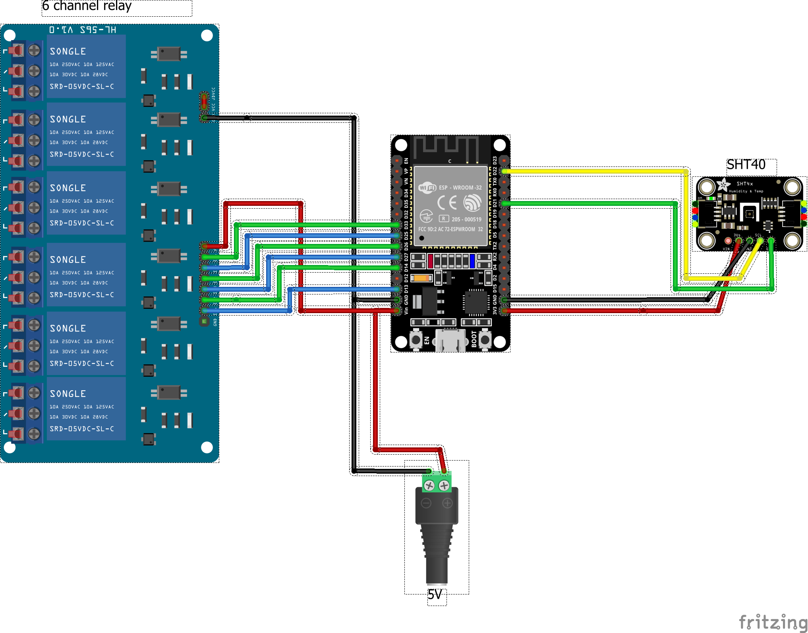
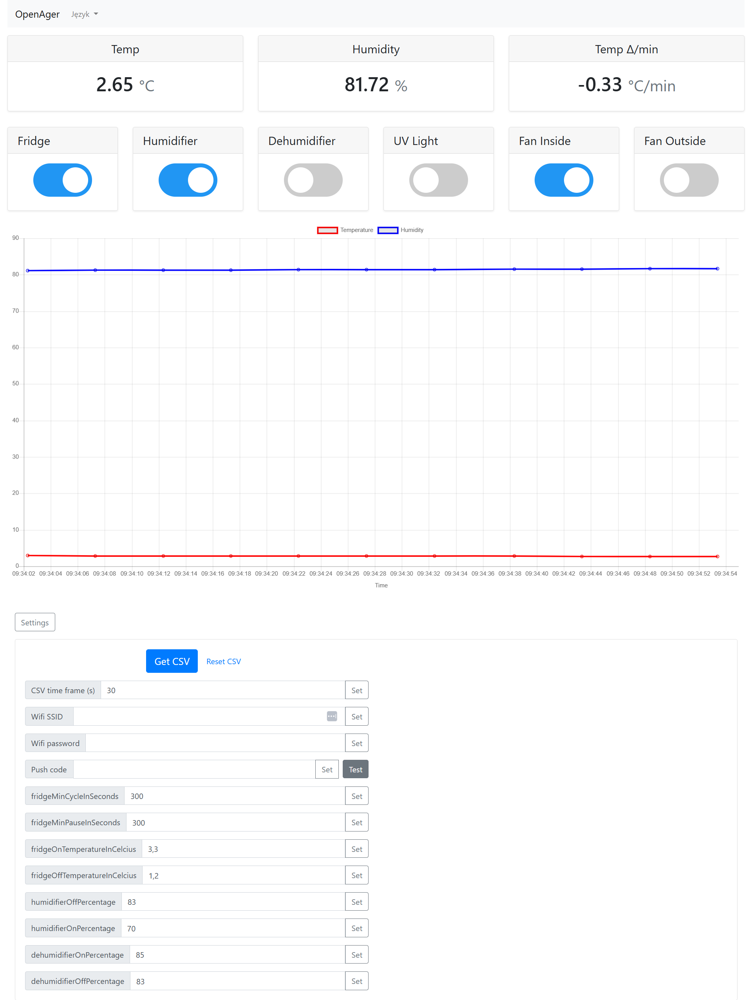

# OpenAger

Project for controlling dry ager. Developed for ESP32.

[](https://buycoffee.to/stefunk)

##  Connections

Connection of end devices is just a proposal, you can even use 12V for everything, relay don't care as long as you will put proper line in COM port.



##  Installation

You need to download Visual Studio together with PlatformIO and upload the files or upload bin files directly to ESP32 - https://github.com/stefunkk/openager/releases/tag/0.1

## Usage

You need to get ip address from your router, or from the console of the device.

* Updates are possible via web interface http://[ip]/update
* Web serial with some debug values available on http://[ip]/webserial
* GPIO Viewer available on http://[ip]:8080

There is a safety timeout for the fridge, by default it's set to 300 seconds.

* fridgeMinCycleInSeconds - you wont be able to turn off fridge before this time pass
* fridgeMinPauseInSeconds - you wont be able to turn on fridge after it stops before this time pass 

## Web interface



## Hardware

All available on aliexpress

* SHT40 Temperature Humidity Sensor Module Probe Cable Waterproof Digital Capacitance Sensors 1M I2C Output (~5.49 EUR) -  https://www.aliexpress.com/item/1005008035782468.html 
* ESP32-CH340C-TYPEC (~3.75 EUR) - https://www.aliexpress.com/item/1005008212851634.html
* 6 channel relay module 5V (~3.58 EUR) - https://www.aliexpress.com/item/10000000669335.html

## Home assistant integration

```yaml
rest:
  - resource: http://[your ip]/data
    scan_interval: 15
    sensor:
      - name: "Ager temperature"
        unique_id: ager_temp
        unit_of_measurement: "°C"
        value_template:  "{{ value_json['temp'] }}"
      - name: "Ager humidity"
        unique_id: ager_humidity
        unit_of_measurement: "%"
        value_template:  "{{ value_json['humidity'] }}" 
    binary_sensor: 
      - name: "Ager fridge State"
        unique_id: ager_fridge_state
        value_template: >
          
            on
          
            off
          
      - name: "Ager dehumidifier state" 
        unique_id: ager_dehumidifier_state
        value_template: >
          
            on
          
            off
          
      - name: "Ager humidifier staet" 
        unique_id: ager_humidifier_state
        value_template: >
          
            on
          
            off
          
```

## License

Free for non-commercial use


