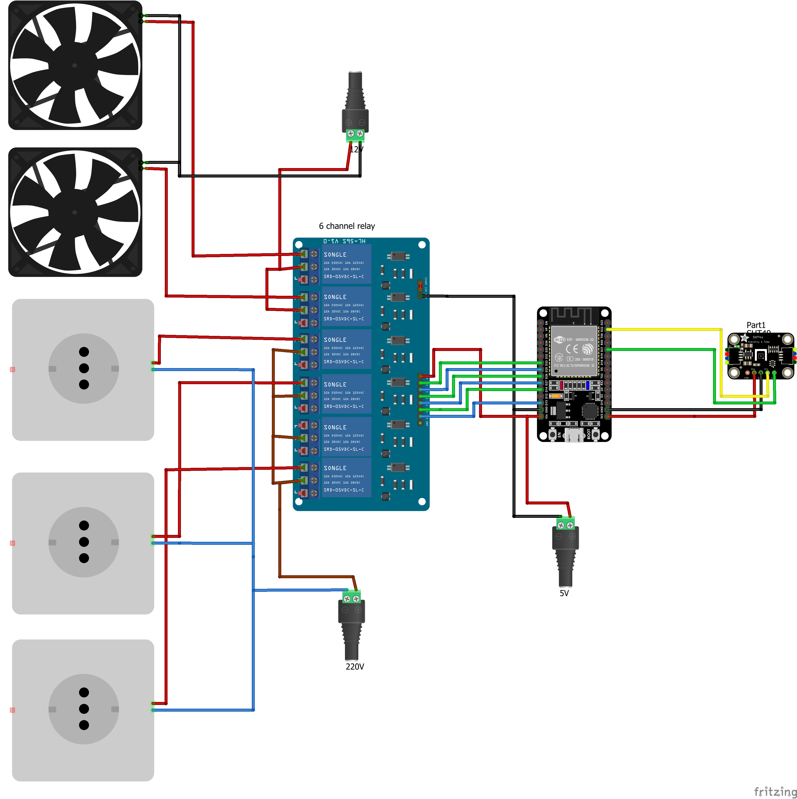

# OpenAger

Project for controlling dry ager. Developed for ESP32.

Parts (all available on aliexpress):

- SHT40 Temperature Humidity Sensor Module Probe Cable Waterproof Digital Capacitance Sensors 1M I2C Output (~5.5 EUR)
- ESP32-CH340C-TYPEC (~3.75 EUR)
- 6 channel relay module 5V (~3.58 EUR)

##  Connections

## Web interface

## Hardware

* Project is developed on ESP32
* SHT40 Sensor
* 6 Relay module

## License

Free for non-commercial use

